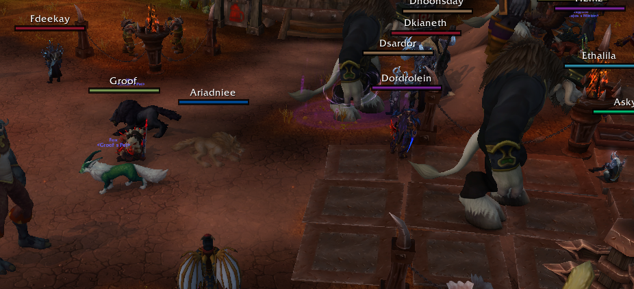
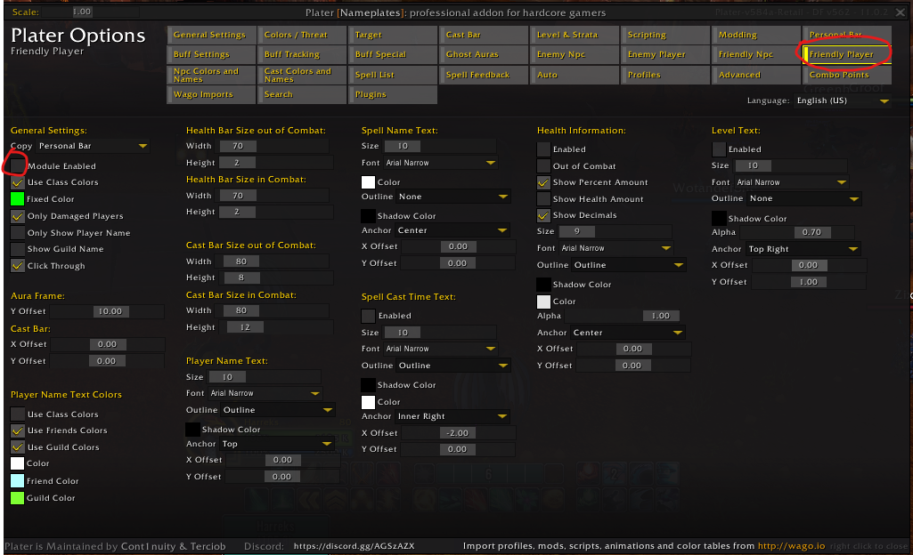
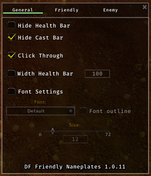
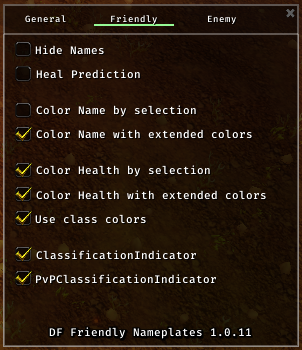
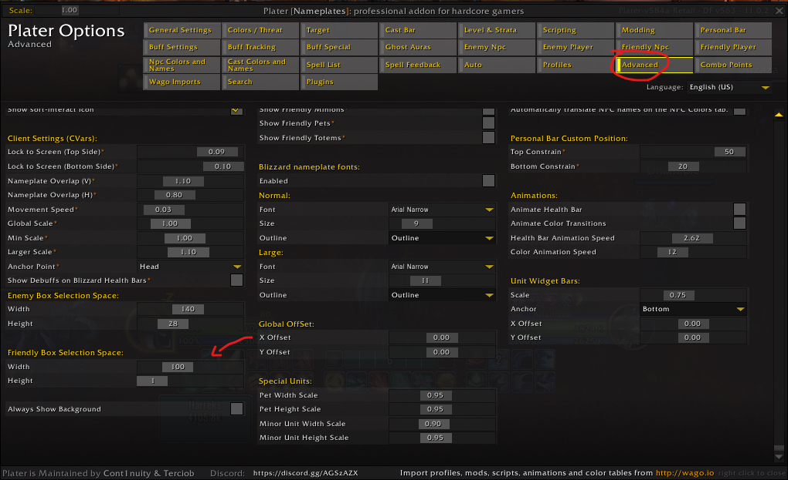
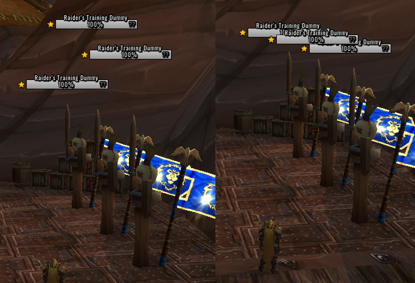
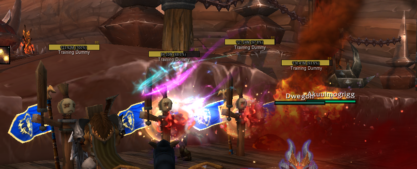

## Intro

Friendly nameplates are a really useful tool when your spells depend on knowing where our party members are positioned. Having a clear way to see where everyone is standing relative to you can help a lot on getting good value out of your frontal cones and straight line spells.

If you just want your friendly nameplates to look like this, and don't care about any specifics or explanations, just follow the steps below. If you want a more in-depth explanation on why things are the way they are and what settings are you changing, keep reading after that.

## Quick Set up

1. Download both [Plater Nameplates](https://www.curseforge.com/wow/addons/plater-nameplates) and [DF Friendly Nameplates](https://www.curseforge.com/wow/addons/df-friendly-nameplates)
2. Open the Plater settings, and on the "Friendly Player" tab, disable the module

3. Open DF Friendly Nameplates by typing /dffn in chat, and set up the options like this:

4. Optionally, check "Hide Health Bar" if you only want the clearer names on top of people and not the whole bar
5. Finally, go back to Plater and in the "advanced" tab, set up the Height to 1 and the Width to whatever size you want

---

## Explanation

Now for the long explanation: the first thing you need to know is that addons (like plater) **can't modify friendly nameplates inside instances**. So you can set up some custom really cool friendly nameplates on a city and then when you step into raid or a dungeon it all gets disabled and you get default nameplates. This comes from all the way back in Legion where some guilds used creative weakauras attached to friendly nameplates to draw lines between players. To avoid people trivializing mechanics in this way Blizzard doesnt let addons touch friendly nameplates in any way.

This doesn't mean you are stuck with default friendly nameplates just as they are, though. You can still modify them slightly, but only using Blizzard's own configuration options. These come in the form of CVars, or character variables. Everytime you open your options and change a setting your selection is saved as a cvar and this is how Blizzard stores information about which options from the settings apply to your character.

The issue is that all the cvars we need to edit are not on the options menu. They do exist but are hidden from the user and need custom code to be edited. You could edit them with a line of code like this:

`/console scriptErrors 0`

But that is annoying, unintuitive and requires you to remember a lot of very specific names and values for every time you need to set them up or adjust them.

The other option is using an addon that runs that code in the background but gives you an easy to use and simple interface for it. For that purpose we are using [Plater Nameplates](https://www.curseforge.com/wow/addons/plater-nameplates) and [DF Friendly Nameplates](https://www.curseforge.com/wow/addons/df-friendly-nameplates). Do note that the settings we are moving on these addons aren't directly editing the friendly nameplates (because that would get deleted when zoning into an instance) but simply telling Blizzard to change certain options to the values you want.

The first thing we need to do, is open Plater and disable the friendly nameplates module:

This way we tell plater to not modify the friendly nameplates with custom code, so we can see what they really look like and can work on them without having to zone into an instance. Disabling this means your friendly nameplates will look the same everywhere (unless you have another addon editing them of course).

Next, we are opening DF Friendly Nameplates and changing some settings:

+ Default nameplates consist of two parts: the character name and the healthbar. This character name is not the same as the default name that shows on top of characters for one very important reason: that name changes in size as the character gets closer or further away from you, while the nameplate name remains the same size always. The "Hide Health Bar" option hides the health bar below the name leaving you with only this consistent character name. For some people just the name is enough to parse where they friends are while for others having the full class-colored bar is better. Totally up to you.

* "Hide Cast Bar" hides a spell cast bar that normally shows below the nameplate healthbar, as we are using the nameplates to see where people are we don't need the added clutter of seeing what they are casting at all times

* "Click Through" makes the nameplates be 'transparent', as in you can freely click on things that are behind them and your click won't ever make you target the nameplate user. This is helpful when, again, we are using the nameplates just to see where people are positioned so we don't need the added funcionality and in some scenarios it might get in the way of you clicking things out in the world or even enemy nameplates sometimes.

* The "Width Health Bar" option controls, well, how wide the bar is. But we are disabling this because we can't edit the height of the healthbar from DFFriendlyNameplates, which is actually really important, so we are gonna do that from Plater. More on that later.

On the "Friendly" tab of options:

* The "Hide Names" option does the oposite than the "Hide Health Bar" option, removing the name and leaving only the bar. Good if you don't care about who people are and just wanna know where the hunter is.

* "Heal Prediction" adds a translucent part to the nameplate healthbar when the player is being targeted by a heal, useful if you want to know if said player is already about to be healed by something.

* Most of the other options here control how colors. Feel free to experiment with them to get them just how you like it but the ones shown in the screenshot are my personal preference

For the final part, we need to go back to Plater for a somewhat complicated reason: During normal gameplay you won't only have friendly nameplates on your screen but also enemy nameplates, and as they are both nameplates they will interact with each other possibly in an annoying way. There is a setting called "Nameplate Motion Type" on the options menu that controls how different nameplates interact with each other

"Stacking Nameplates" will make nameplates move above and below each other so you can clearly view them regardless of how are units positioned. While "Overlapping Nameplates" will make the nameplates stay exactly above the unit they belong to regardless of being partially or totally covered by other nameplates in front of them.

Now this leaves us in an annoying situation: In my opinion the ideal for enemy nameplates is to have them stacking, so you can always see all the nameplates and get the information from each mob without having it covered by other units, while for friendly nameplates you really want them to always be on top on the player they belong to, so you can tell exactly where they are standing

You can't pick different options for each, they are controled by the same setting. And so we are gonna use a workaround for this: On the options panel make sure you have "Stacking Nameplates" selected, so the enemy nameplates behave how we want them to, and then on the Plater options you will go to "advanced" and edit these settings:

You can use the "Width" setting to control the actual displayed width of the nameplate healthbar, adjust this to your liking. For the "Height" one though, this won't actually edit how tall the bar is, but instead how tall other nameplates think it is. By setting it to one, we make all other nameplates behave like the friendly ones weren't there, and so they won't move around to give space to other nameplates like normal Stacking Nameplates behaviour would dictate.

And our final result: A very clear name and class-colored healthbar for each friendly player, that always sticks exactly to on top of their character and doesn't move around, while also not altering how our enemy nameplates move, look, or stack to each other. And all of this works exactly the same when you zone in into an instance.

